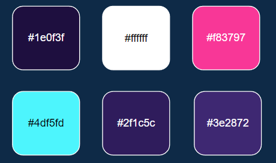

#   Meat Store e-commerce 🏪

* Red Meat: All livestock is considered red meat. This includes beef, pork, goat, and lamb.
* Poultry: Commonly referred to as white meat, poultry includes chicken and turkey.
* Plant based: Food industrie now bring to our a new concept of meat, using plants to re-create Plant Based Meats and more healthy than others.
* Seafood: That includes fish, as well as crustaceans, like crab and lobster, and molluscs, like clams, oysters, scallops, and mussels.

##  Styles
* Fonts & colors used

##  Font
### Quicksand

* https://fonts.google.com/specimen/Quicksand

#1e0f3f

#ffffff 

#ece7ca

#f83797

#4df5fd

#2f1c5c

#3e2872

> This project was created using React.JS 

## Available Scripts
Before run please instal npm dependencies

In the project directory, you can run:

### `clone git repositore`
### `npm install`
### `npm start`

Runs the app in the development mode.\
Open [http://localhost:3000](http://localhost:3000) to view it in your browser.

The page will reload when you make changes.\
You may also see any lint errors in the console.

